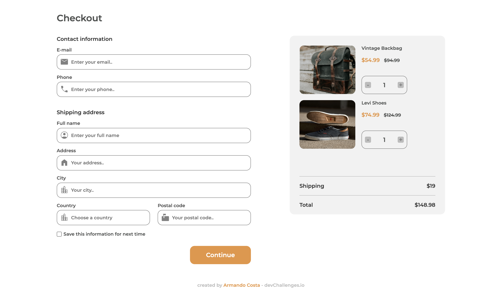

<!-- Please update value in the {}  -->

<h1 align="center">Checkout page challenge</h1>

<div align="center">
   Solution for a challenge from  <a href="http://devchallenges.io" target="_blank">Devchallenges.io</a>.
</div>

<div align="center">
  <h3>
    <a href="https://{your-demo-link.your-domain}">
      Demo
    </a>
    <span> | </span>
    <a href="https://github.com/Costa0910/checkout-page-challenge">
      Solution
    </a>
    <span> | </span>
    <a href="https://devchallenges.io/challenges/0J1NxxGhOUYVqihwegfO">
      Challenge
    </a>
  </h3>
</div>

<!-- TABLE OF CONTENTS -->

## Table of Contents

- [Overview](#overview)
  - [Built With](#built-with)
- [Features](#features)
- [Contact](#contact)

<!-- OVERVIEW -->

## Overview



### Built With

- HTML
- Sass

## Features


This application/site was created as a submission to a [DevChallenges](https://devchallenges.io/challenges) challenge. The [challenge](https://devchallenges.io/challenges/0J1NxxGhOUYVqihwegfO) was to build an application to complete the given user stories.


## How To Use

To clone and run this application, you'll need [Git](https://git-scm.com) (or download files without cloning), if you choose git follow the below step.
command line:

```bash
# Clone this repository
$ git clone https://github.com/Costa0910/checkout-page-challenge

```

## Contact

- DevChallenge [Costa0910](https://devchallenges.io/portfolio/Costa0910)
- Linkedin [Armando Costa](https://www.linkedin.com/in/armando-costa12/)
